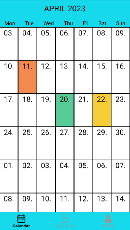
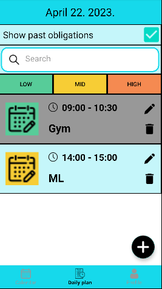
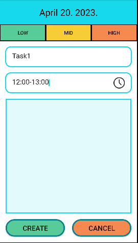
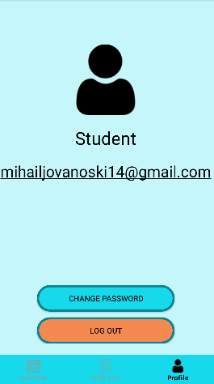

# TaskPlanner

Simple task planner for Android mobile devices. It is written in Java using AndroidStudio.

The calendar is a simple calendar that allows you to add tasks to a specific date. The tasks, users are stored in a SQLite database.  
On the calendar you can see the importance of the most important task for every day.  
For every date there is a list of tasks planned for that date.  
Every task has a title, starting and ending time, priority.  
App also provides possibility for multiple users to use the app considering every task is connected to specific user in database.  

The dailytasks list allows you to filter the tasks by priority, status, and title.

| Calendar  | Daily tasks |
| ------------- | ------------- |
|   |   |

| Creating new task  | My profile |
| ------------- | ------------- |
|   |   |

## Implementation

SQLite, ViewModel, LiveData, RecyclerView, Fragments, ViewPager, BottomNavigationView.
